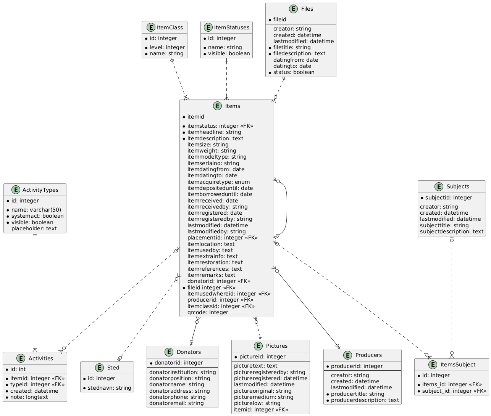
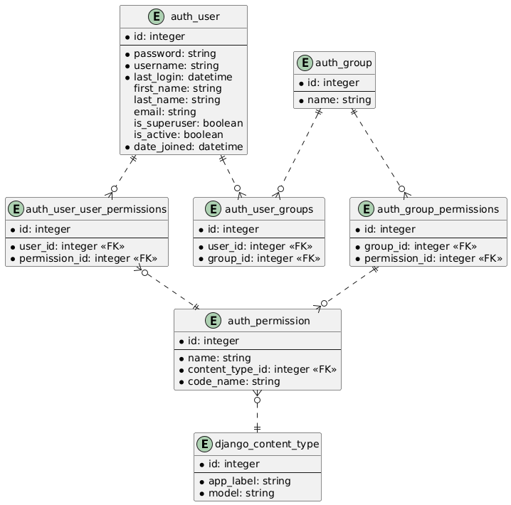

# Database structure

The main entity is the Items. An item must have an item class, a status and belong to a file - i.e. a case file. You can then specify a producer of the item, a donor, and a place where its primary use was. These come from lists. You can attach pictures and give it zero or more subjects.

In its life cycle in the museum the item will accumulate activities, which are dated notes about events.

## Items

## Authentication

The authentication tables come from the Django edition. It maps pretty cleanly to Spring Security concepts, if you replace groups with roles.

