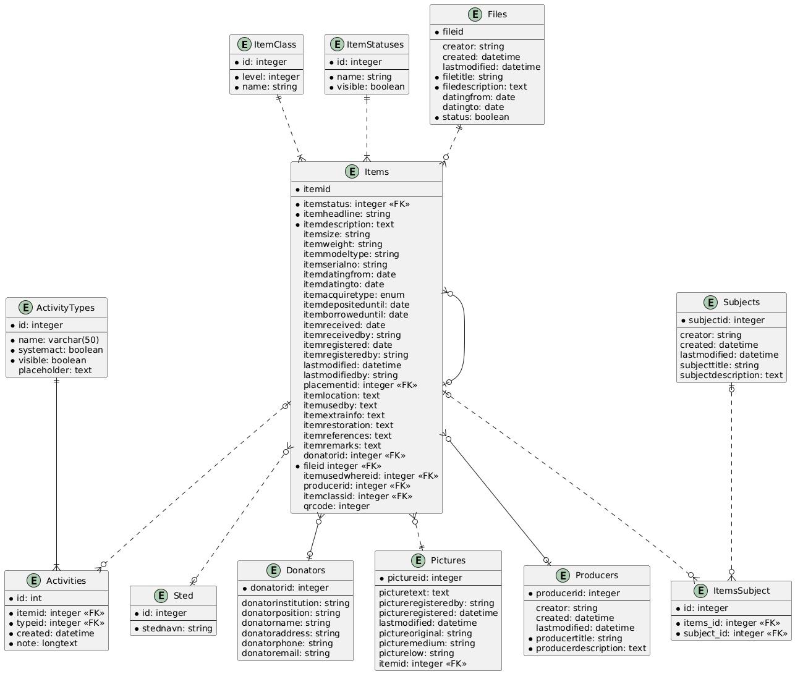
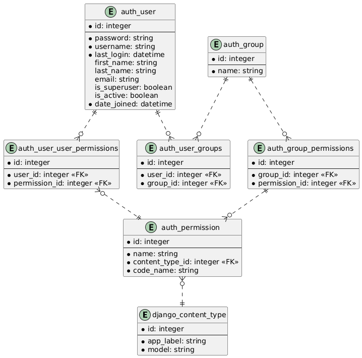

# Database structure

The main entity is the Items. An item must have an item class, a status and belong to a file - i.e. a case file. You can then specify a producer of the item, a donator, and a place where its primary use was. These come from lists. You can attach pictures and give it zero or more subjects.

In its life cycle in the museum the item will accumulate activities, which are dated notes about events.

## Items

### Constraints

* An item must belong to a file.
* An item must have a status.
* An item must have an item_class.
* An activity must belong to an item. When the item is deleted, then all associated activities are deleted. Enforced in the database with cascade constraint.
* An picture must belong to an item. When the item is deleted, then all associated pictures are deleted. Enforced in the application.
* An item may have a producer
* An item may have a donator.

## Authentication

The authentication tables come from the Django edition. It maps pretty cleanly to Spring Security concepts, if you replace groups with roles.

